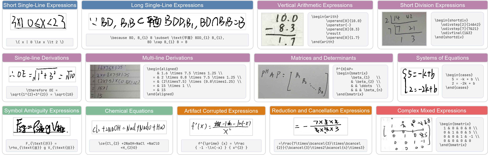
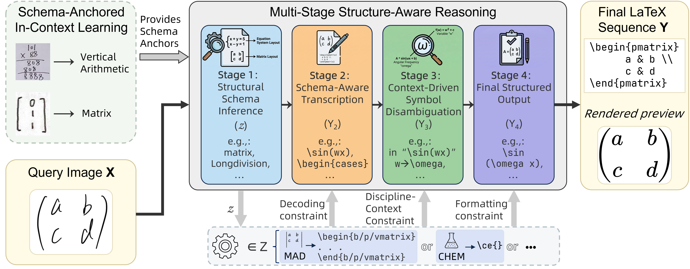

# Seeing Symbols, Missing Structure: A Real-World Handwritten Mathematical Expression Recognition Benchmark for Large Models

## Overview

HMER-Bench is a real-world handwritten mathematical expression recognition benchmark designed to evaluate whether large vision-language models can recover not only local symbols, but also global two-dimensional mathematical structures.

The benchmark contains **13,513 handwritten expressions** across **13 fine-grained categories**, covering long expressions, multi-line derivations, vertical arithmetic, short division, systems of equations, matrices and determinants, chemical equations, artifact-corrupted expressions, and reduction/cancellation expressions.

We also provide **Schema-Anchored Structure-Aware Reasoning (SASR)**, a training-free inference framework that first identifies the structural schema of a handwritten expression and then performs schema-constrained transcription.

## DataSet

## Quick Start

We are preparing the benchmark data code for release.
